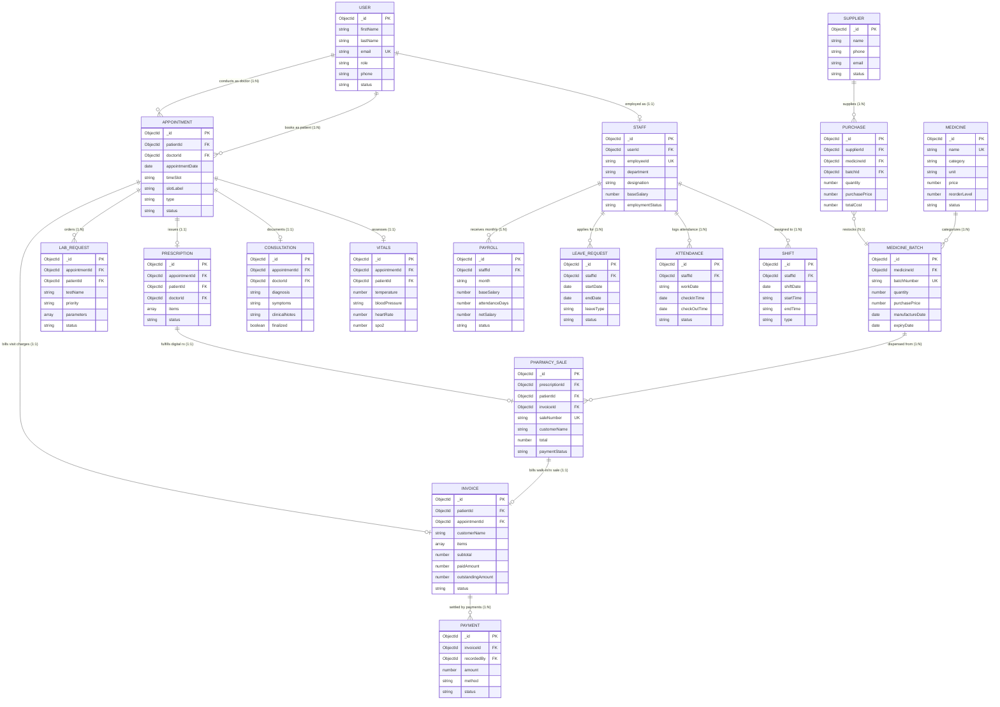

# Health Guard Medical Center Management System
## Entity Relationship Diagram (ERD) & Database Schema Guide for Viva

---

## 1. Diagram Files & How to Open

The complete, multi-page Draw.io ERD file has been created at:
📍 **[`docs/HealthGuard_ERD.drawio`](./HealthGuard_ERD.drawio)**

### How to Open & Present in Draw.io:
1. Go to **[https://app.diagrams.net](https://app.diagrams.net)** (or open the **Draw.io Desktop** / VS Code Draw.io extension).
2. Click **File → Open From → Device** (or drag & drop `docs/HealthGuard_ERD.drawio` into the browser window).
3. The file contains **2 complete pages** accessible via the bottom page tabs in Draw.io:
   - **Tab 1: `1. Conceptual ERD (Chen Notation)`** — The classical Chen notation matching your lecture/viva reference (Rectangles for Entities, Red Diamonds for Relationships, Ellipses for Attributes, Red Underlined Ellipses for Primary Keys).
   - **Tab 2: `2. Logical Relational ERD (Schema & Types)`** — The complete relational database schema table layout with column data types, `PK` / `FK` markers, and Crow's Foot cardinality links.
4. To export for submission:
   - Click **File → Export as → PDF** or **PNG** (transparent background, 300 DPI) for slide decks or printed reports.

---

## 2. Interactive Mermaid ER Diagram Preview

---

## 3. Key Architectural Relationships for Viva Explanations

During your viva presentation, examiners typically ask about cross-epic relationships and data integrity. Here are the key integration points:

| Integration Point | Epics Linked | Relationship & Rule |
|---|---|---|
| **Workforce Attendance → Payroll** | E1 → E4 | `Staff.attendanceDays` calculated dynamically from checked-out `Attendance` records in the month to compute `Payroll.netSalary = (baseSalary / 26) * attendanceDays + allowances - deductions`. |
| **Doctor Prescription → Pharmacy POS** | E2 → E3 | When a doctor writes a `Prescription`, it links via `Prescription._id` to `PharmacySale`. Dispensing automatically marks prescription status as `"dispensed"`. |
| **Clinical Consultation / Vitals → Invoice** | E2 → E4 | When a patient appointment is completed, consultation and lab request items are consolidated into an `Invoice` with line items and subtotal. |
| **Pharmacy Sales → Cashier Billing** | E3 → E4 | Both registered patient and walk-in unregistered sales generate an `Invoice`. When the Cashier records the `Payment`, `PharmacySale.paymentStatus` automatically updates to `"paid"`. |
| **Supplier Delivery → Inventory Batches** | E3 | Recording a supplier `Purchase` auto-generates sequential batch identifiers (e.g. `PCM-LK-2601`) and updates batch inventory stock atomically. |
